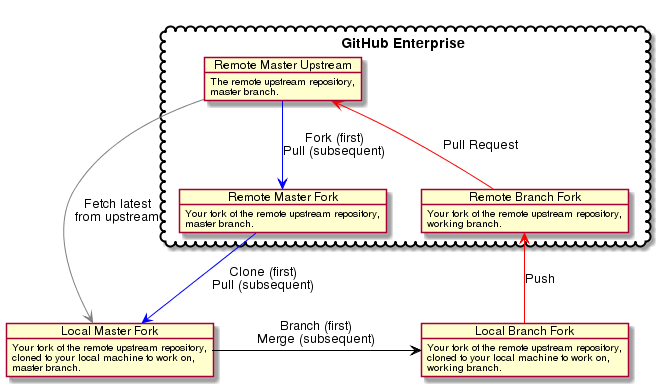

# How to Contribute

<details>
<summary>
<b>Table of Contents</b>
</summary>

* [Contribution Workflow](#contribution-workflow)
* [Issue Tracking](#issue-tracking)
* [First-Class Features](#first-class-features)
   * [One-Way Git Merges](#one-way-git-merges)
* [Keybase](#keybase)
* [Git Configuration](#git-configuration)
* [Coding Standards](#coding-standards)
   * [Classes](#classes)
   * [Traits](#traits)
   * [White Space](#white-space)
   * [Type Hinting](#type-hinting)
   * [Lists of Parameters](#lists-of-parameters)
   * [Comments](#comments)
   * [DocBlocks](#docblocks)
   * [Licenses](#licenses)
   * [Errors and Warnings](#errors-and-warnings)
   * [String Interpolation](#string-interpolation)
   * [Ternary statements](#ternary-statements)
   * [CLI](#cli)
   * [Spelling](#spelling)
   * [Naming](#naming)
   * [Blacklisted](#blacklisted)
* [Legal and Licenses](#legal-and-licenses)

</details>

## Contribution Workflow

We generally use a blend of [git-flow](https://github.com/nvie/gitflow/) and [GitHub Flow](https://guides.github.com/introduction/flow/).

1. [Fork the repository](https://help.github.com/articles/fork-a-repo/) into your own, personal GitHub account.

1. [Clone your GitHub copy of the repository](https://help.github.com/articles/fork-a-repo/#step-2-create-a-local-clone-of-your-fork) into your local workspace. This will make _your fork_ of the repository the remote `origin` by default.

1. [Add the original repository as the upstream repository](https://help.github.com/articles/fork-a-repo/#step-3-configure-git-to-sync-your-fork-with-the-original-spoon-knife-repository) (so that you can pull down the latest changes). You can name it something like `upstream` or `up` for short.

1. [Create a new branch](https://help.github.com/articles/about-branches/) (this is where [git-flow](http://nvie.com/posts/a-successful-git-branching-model/) comes in).

    * The `master` branch should be able to ship to _Production_ at all times.
    * We do not use a `develop` branch. Since we are following the continuous deployment pattern, all changes should be small and well-tested.
    * A branch for a new feature should be prefixed with `feature/` (e.g., `feature/my-awesome-feature`).
    * A branch for a release should be prefixed with `release/` (e.g., `release/1.2.1`).
    * A branch for a hotfix should be prefixed with `hotfix/` and finish with the issue ID (e.g., `hotfix/1234`).
    
1. Write code, fix bugs, and add tests with 100% code coverage.

1. Pull down changes from `origin/master` to your local `master`, then merge from your local `master` into your development branch. (Do not merge directly from `origin/master` to your development branch, or your local `master` will fall out of sync and mistakes become more likely.)

1. Commit your changes to your local workspace and push them up to your GitHub copy (e.g., the `origin` remote).

1. [Submit a GitHub pull request against the source repository](https://help.github.com/articles/creating-a-pull-request-from-a-fork/) (i.e., `origin/master`) with a description of what the change is. You should assign the proper groups of people to review.

1. [There should be 2 mandatory reviewers](https://help.github.com/articles/merging-a-pull-request/) for your PR, if possible. Maybe there will be some banter back-and-forth in the comments. In the end, there should be 2 code reviews marked as "approved".

1. The tests are run via Travis CI. [Passing tests are a prerequisite for merging the PR.](https://help.github.com/articles/working-with-protected-branches/)

1. If all goes well, your pull request will be accepted and [your changes are merged in](https://help.github.com/articles/merging-a-pull-request/). “Squash merging” is used, which is the combination of all commits from the head branch (your branch) into a single commit in the base branch (master).

## Issue Tracking

We don't use GitHub for managing issues and feature requests (you should notice that _Issues_ have been disabled in all repositories). All bugs/tasks/stories are managed via _Issues_.

## First-Class Features

These are all things which should be considered first-class features of this project (in no particular order):

* **Project Documentation:** This should include how to get a local development environment started, nuances of how scripts are run, what the deployment pipeline looks like, how specific features of the service are implemented.

* **Security:** We need to be security-first in everything we do. This means things like HTTPS-for-everything, XSS and CSRF protection, and even integrating with other services to ensure that our dependencies and containers are secure.

* **Performance:** Go, Speed Racer, Go! What can we do to make this package as performant as possible (without sacrificing scalability)? Will other tools or technologies enable us to run faster? Will different processes help us squeeze every last ounce out of our network connections? Even micro-optimizations are good if they're easy to apply.

* **Metrics:** We should be keeping track of things throughout the system. How long did this script take to run? How many images are being processed by the backend, in which formats? How long are authors spending working with our widgets and tools? Let's track as much as we should so that we can answer questions that we haven't thought about yet.

### One-Way Git Merges



## Keybase

[Keybase](https://keybase.io) makes secure sharing of secrets easy, and is strongly recommended. We share encrypted secrets with each other using [KBFS](https://keybase.io/docs/kbfs). We also have a [Keybase Team](https://keybase.io/docs/teams/index) set up for encrypted communications.

## Git Configuration

There are a few settings that would be good to apply to your Git configuration. These can by applied to your local clone by running `git config {setting}`. They will be written to `.git/config` in your project root.

| Setting | Description |
| ------- | ----------- |
| `apply.whitespace fix` | Correct whitespace weirdness automatically. |
| `commit.gpgsign true` | It is greatly preferred if you would GPG-sign your commits. This requires having GPG set up. (Keybase makes this easy!) [§](https://git-scm.com/docs/git-config#git-config-commitgpgSign) |
| `core.autocrlf false` | No automatic Windows-style (`CRLF`, `\r\n`) line endings. [§](https://git-scm.com/docs/git-config#git-config-coreautocrlf) |
| `core.eol lf` | Force Unix-style (`LF`, `\n`) line endings. [§](https://git-scm.com/docs/git-config#git-config-coreeol) |
| `core.ignorecase false` | Tells Git that case sensitivity is important. Helps your collaborators using macOS. [§](https://git-scm.com/docs/git-config#git-config-coreignoreCase) |
| `core.safecrlf true` | Warn about line-ending weirdness. [§](https://git-scm.com/docs/git-config#git-config-coresafecrlf) |
| `pull.ff only` | Only such fast-forward merges are allowed. This helps us catch weirdness with force-pushes. [§](https://git-scm.com/docs/git-config#git-config-pullff) |
| `pull.rebase true` | Applies `git pull --rebase` by default. [§](https://git-scm.com/docs/git-config#git-config-pullrebase) |
| `push.default simple` | This is the default for Git 2.0 and newer. Some Linuxes have Git 1.x built-in still. [§](https://git-scm.com/docs/git-config#git-config-pushdefault) |

## Coding Standards

The linter will address _most_ formatting/stylistic issues. This can (and should!) be run from the command line before submitting a PR.

```bash
make lint
```

There are a few things it doesn't (yet) cover.

### Classes

* All classes used inside a namespaced file should have a `use` statement.

* You SHOULD use `use` statements for classes in the root namespace. `use Exception; throw new Exception();` is preferred over `throw new \Exception();`. [§](https://github.com/php-fig/fig-standards/blob/master/proposed/extended-coding-style-guide.md#3-declare-statements-namespace-and-use-declarations)

### Traits

* [Clarification of PSR-12] Each individual Trait that is imported into a class MUST be included one-per-line, and each inclusion MUST have its own `use` statement. This matches the PSR-2 format for including Namespaces and Namespace Aliases. [§](https://github.com/php-fig/fig-standards/blob/master/proposed/extended-coding-style-guide.md#42-using-traits)

### White Space

* There should be an empty line immediately preceding a _block_ of code (e.g., `for`, `foreach`, `if`, `while`, `do`).

* Indenting should be 4 spaces — but this applies universally. For example, if you want to bump a `->` marker to a new line, it should be indented 4 spaces from the start of the statement. It should not be pushed further to the right to align with some other point in the line above.

  ```php
  $isSaved = Db\Achieve\Areas::factory($container['db'])
      ->insert(
          // ...
      );
  ```

* For indented sub-statements (above), there should be one empty line above and below. This assists readability.

### Type Hinting

* You should favor strict type hints on parameters whenever possible.

* Likewise, you should favor string return types whenever possible.

### Lists of Parameters

* The quantity of parameters per method should be as few as possible, but no fewer.

### Comments

* There should be one space after the `//` marker.

### DocBlocks

* Arrays of a single type should be documented as that type + `[]`. For example, an array of strings should be annotated as `string[]`.

* Use the shorter-form namespace aliases in for types. When we have defined `use Monolog\Logger;`, use `Logger` instead of `Monolog\Logger` in DocBlocks.

### Licenses

* Any short-hand refrences to software licenses should use the [SPDX identifier](https://spdx.org/licenses/).

### Errors and Warnings

* Code must not produce any warnings or errors when PHP's error reporting level is set to `error_reporting(-1)`.

### String Interpolation

* `sprintf()` is preferred over string concatenation/interpolation.

### Ternary statements

* No more than a single condition should go into a ternary statement. Use a switch-case or if-else condition instead.

* Don't test if the statement is `false`. That becomes confusing fast.

* Long-form ternary statements should be indented as follows:

  ```php
  $assignment = (condition inside parentheses)
      ? true
      : false;
  ```

* Short-form operations (e.g., `??`, `?:`) should have the operator start on the same line as the condition.

  ```php
  $assignment = (condition inside parentheses) ?? default;

  $assignment = (condition inside parentheses) ?: default;

  $next = $next ?: function (Request $request, Response $response) {
      return $response;
  };
  ```

### CLI

When writing CLI scripts, don't presume to know where the PHP binary is installed. Use the `env` binary to pick-up from the local environment (i.e., `#! /usr/bin/env php`).

### Spelling

If there is ever a discrepancy between English-speaking dialects, use **U.S. English** as a baseline for both spelling and word choice. [Grammarist](http://grammarist.com/spelling/) and similar websites can help ensure intended usage.

```
color (correct)
colour (incorrect)

spelled (correct)
spelt (incorrect)

canceled (correct)
cancelled (incorrect)

labeled (correct)
labelled (incorrect)

math (correct)
maths (incorrect)

apartment (correct)
flat (incorrect)

"Apple is very successful." (correct)
"Apple are very successful." (incorrect)
```

### Naming

* Variables are `$camelCase`.

* Constants are always `ALL_CAPS`.

* Abstract classes should be called `Abstract{Name}`.

* Interfaces should be called `{Name}Interface`.

* Traits should be called `{Name}Trait`.

* Namespaces, classes, traits, interfaces, etc., should all prefer singular names.

  ```php
  MyCode\Mixin\ResponseHandler
  MyCode\Mixin\TableFormatter
  MyCode\Utility\DataGenerator
  ```

* There's no hard and fast rule when it comes to the length of a name, so just try and be as concise as possible without affecting clarity too much.

### Blacklisted

Never use the following features of PHP. The world will come to an end if you do.

* [`extract()`](http://php.net/extract)
* [`eval()`](http://php.net/eval)
* [`GOTO`](http://php.net/goto)

## Legal and Licenses

The short version is that we should strive to be [compatible with Apache 2.0](https://www.apache.org/legal/resolved.html). The biggest issue of these is no GPL/LGPL/AGPL or other _copyleft_ licenses. (See [The Ultimate GPL Survival Guide](https://blog.fossa.io/the-ultimate-gpl-survival-guide-fe24e6181d39) for a non-exhaustive overview.)

This project's license can be viewed in `LICENSE.md`.
